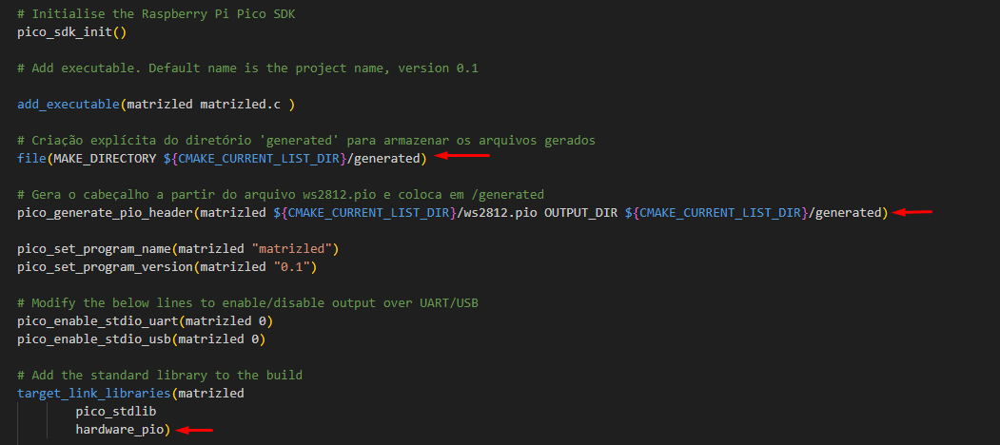

# ws2812-picow

Nesse material, será um passo a passo de como usar Leds endereçaveis WS2812 usando o recurso de PIO do RP2040. A placa usada será a BitDogLab, fornecida no curso EmbarcaTech.

A placa contêm 25 leds endereçáveis conectados à porta GPIO 7 do microcontrolador.

Como funciona os leds? Basicamente você precisa enviar uma sequência de dados para os leds na ordem das cores que você quer acender. Na nossa placa nos temos 25 leds, então se você mandar 25 cores, todos os leds acenderão na cor enviada. VOcê pode encontrar mais detalhes sobre o WS2812, no link:

> https://cdn-shop.adafruit.com/datasheets/WS2812.pdf

O primeiro passo é criar o projeto , nesse tutorial vamos utilizar o VSCode + SDK Pico em C.

Depois, precisamos criar o código PIO que servirá para enviar os dados à GPIO conectado aos leds.

O código/arquivo PIO está disponível nesse repositório, crie o arquivo **ws2812.pio** na raiz do seu projeto.
```assembly
;
; Copyright (c) 2020 Raspberry Pi (Trading) Ltd.
;
; SPDX-License-Identifier: BSD-3-Clause
;
.pio_version 0 // only requires PIO version 0

.program ws2812
.side_set 1

; The following constants are selected for broad compatibility with WS2812,
; WS2812B, and SK6812 LEDs. Other constants may support higher bandwidths for
; specific LEDs, such as (7,10,8) for WS2812B LEDs.

.define public T1 3
.define public T2 3
.define public T3 4

.lang_opt python sideset_init = pico.PIO.OUT_HIGH
.lang_opt python out_init     = pico.PIO.OUT_HIGH
.lang_opt python out_shiftdir = 1

.wrap_target
bitloop:
    out x, 1       side 0 [T3 - 1] ; Side-set still takes place when instruction stalls
    jmp !x do_zero side 1 [T1 - 1] ; Branch on the bit we shifted out. Positive pulse
do_one:
    jmp  bitloop   side 1 [T2 - 1] ; Continue driving high, for a long pulse
do_zero:
    nop            side 0 [T2 - 1] ; Or drive low, for a short pulse
.wrap

% c-sdk {
#include "hardware/clocks.h"

static inline void ws2812_program_init(PIO pio, uint sm, uint offset, uint pin, float freq, bool rgbw) {

    pio_gpio_init(pio, pin);
    pio_sm_set_consecutive_pindirs(pio, sm, pin, 1, true);

    pio_sm_config c = ws2812_program_get_default_config(offset);
    sm_config_set_sideset_pins(&c, pin);
    sm_config_set_out_shift(&c, false, true, rgbw ? 32 : 24);
    sm_config_set_fifo_join(&c, PIO_FIFO_JOIN_TX);

    int cycles_per_bit = ws2812_T1 + ws2812_T2 + ws2812_T3;
    float div = clock_get_hz(clk_sys) / (freq * cycles_per_bit);
    sm_config_set_clkdiv(&c, div);

    pio_sm_init(pio, sm, offset, &c);
    pio_sm_set_enabled(pio, sm, true);
}
%}

.program ws2812_parallel

.define public T1 3
.define public T2 3
.define public T3 4

.wrap_target
    out x, 32
    mov pins, !null [T1-1]
    mov pins, x     [T2-1]
    mov pins, null  [T3-2]
.wrap

% c-sdk {
#include "hardware/clocks.h"

static inline void ws2812_parallel_program_init(PIO pio, uint sm, uint offset, uint pin_base, uint pin_count, float freq) {
    for(uint i=pin_base; i<pin_base+pin_count; i++) {
        pio_gpio_init(pio, i);
    }
    pio_sm_set_consecutive_pindirs(pio, sm, pin_base, pin_count, true);

    pio_sm_config c = ws2812_parallel_program_get_default_config(offset);
    sm_config_set_out_shift(&c, true, true, 32);
    sm_config_set_out_pins(&c, pin_base, pin_count);
    sm_config_set_fifo_join(&c, PIO_FIFO_JOIN_TX);

    int cycles_per_bit = ws2812_parallel_T1 + ws2812_parallel_T2 + ws2812_parallel_T3;
    float div = clock_get_hz(clk_sys) / (freq * cycles_per_bit);
    sm_config_set_clkdiv(&c, div);

    pio_sm_init(pio, sm, offset, &c);
    pio_sm_set_enabled(pio, sm, true);
}
%}
```


Em seguida, abra o CMakeLists.txt e adicione as seguintes linhas:

```cmake
# Criação explícita do diretório 'generated' para armazenar os arquivos gerados
file(MAKE_DIRECTORY ${CMAKE_CURRENT_LIST_DIR}/generated)

# Gera o cabeçalho a partir do arquivo ws2812.pio e coloca em /generated
pico_generate_pio_header(matrizled ${CMAKE_CURRENT_LIST_DIR}/ws2812.pio OUTPUT_DIR ${CMAKE_CURRENT_LIST_DIR}/generated)

# Add the standard library to the build
target_link_libraries(matrizled
        pico_stdlib
        hardware_pio)
```



Depois, na interface do addon para raspberry pico, clique para configurar o CMake para atualizar o projeto.


Antes de continuar, faça um build do seu projeto para ele criar o arquivo header do seu recurso de PIO que controlará o WS2812. Aguarde a conclusão.


Após o build completo, você conseguirá ver o arquivo .h que foi criado dentro do diretório generated.


Agora no código do seu projeto, faça os includes necessários.

```c
#include "hardware/pio.h"
#include "ws2812.pio.h"
```

Define o pino da conexão

```C
#define WS2812_PIN 7
#define IS_RGBW false //O led nao tem o branco individual
```

Crie duas funções para envio da cor e configuração correta da cor no formato correto.

```C
// Envia a cor ao led
static inline void put_pixel(PIO pio, uint sm, uint32_t pixel_grb) {
    pio_sm_put_blocking(pio, sm, pixel_grb << 8u);
}

// Recebe as cores RGB e retorna no formato dos 24bits que precisa
static inline uint32_t urgb_u32(uint8_t r, uint8_t g, uint8_t b) {
    return
            ((uint32_t) (r) << 8) |
            ((uint32_t) (g) << 16) |
            (uint32_t) (b);
}
```

Crie os objetos para configuração do PIO

```C
PIO pio;//Objeto PIO para a matriz de led
uint sm;//Objeto SM stateMachine para a matriz de led
uint offset = 0;//Memory offset para a matriz de led
```

Crie suas funções para controlas os leds, no exemplo abaixo, a função recebe q quantidade de leds que deve acender e quantidade total de led.

```C
void show_queue(uint8_t len, uint8_t max_len){
    uint8_t intensidadeCor = 5;
    for(int i = 0; i < max_len; i++){
        if(i < len){
            put_pixel(pio, sm, urgb_u32(intensidadeCor, 0, 0));//Acende somente o vermelho
        }else{
            put_pixel(pio, sm, urgb_u32(0, 0, 0));//Apaga o led
        }
    }
    sleep_us(10);
}
```

E na sua função principal inicialize os objetos/estruturas.

> No exemplo abaixo, a cada 1 segundos será aceso uma quantidade aleatória de leds entre 0 e 24

```c
int main()
{
    stdio_init_all();
    bool success = pio_claim_free_sm_and_add_program_for_gpio_range(&ws2812_program, &pio, &sm, &offset, WS2812_PIN, 1, true);

    ws2812_program_init(pio, sm, offset, WS2812_PIN, 800000, IS_RGBW);

    while (true) {
        int r = rand() % 25;
        show_queue(r, 25);
        sleep_ms(1000);
    }

    pio_remove_program_and_unclaim_sm(&ws2812_program, pio, sm, offset);
}
```

Pronto! Faça o build do seu projeto e transfira para seu Raspyberry Pico W